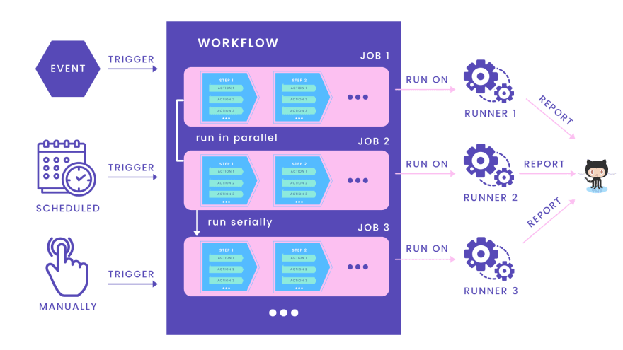

# Setup Github Actions for Golang + Postgres to run automated tests

持续集成工具：

- **github actions**
- jenkins
- travis
- circleci

定义workflow：

- workflow是一个自动程序
- 它由不止一个job组成
- 由事件、scheduled或手动触发
- 向仓库中添加`.yaml`文件

runner：

- 用来运行job的服务器
- 每次运行一个job
- github自己的主机
- 向github报告过程、logs、结果

job：

- 在runner上执行一系列step的集合
- 独立的jobs并行运行
- 依赖的jobs串行运行

step：

- 表示一个单独的任务
- 在一个job内串行运行
- 包含不止一个action

action：

- 一个单独的命令
- 可以被重用

