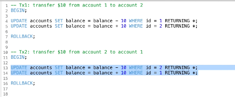
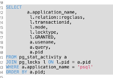

# How to avoid deadlock in DB transaction? Queries order matters!

如何避免数据库事务中的死锁？





为什么会发生死锁？两个事务互相持有锁并等待对方的锁。

解决方案？控制一样的查询顺序。

控制转账顺序，只能account id小的给account id大的转账。 

```go
if arg.FromAccountID < arg.ToAccountID {
    result.FromAccount, result.ToAccount, err = addMoney(ctx, q, arg.FromAccountID, -arg.Amount, arg.ToAccountID, arg.Amount)
} else {
    result.FromAccount, result.ToAccount, err = addMoney(ctx, q, arg.ToAccountID, arg.Amount, arg.FromAccountID, -arg.Amount)
}
```

account1 向 account2 转账：

```go
func addMoney(
	ctx context.Context,
	q *Queries,
	accountID1 int64,
	amount1 int64,
	accountID2 int64,
	amount2 int64) (account1 Account, account2 Account, err error) {
	account1, err = q.AddAccountBalance(ctx, AddAccountBalanceParams{
		ID:     accountID1,
		Amount: amount1,
	})
	if err != nil {
		return
	}

	account2, err = q.AddAccountBalance(ctx, AddAccountBalanceParams{
		ID:     accountID2,
		Amount: amount2,
	})
	return
}
```