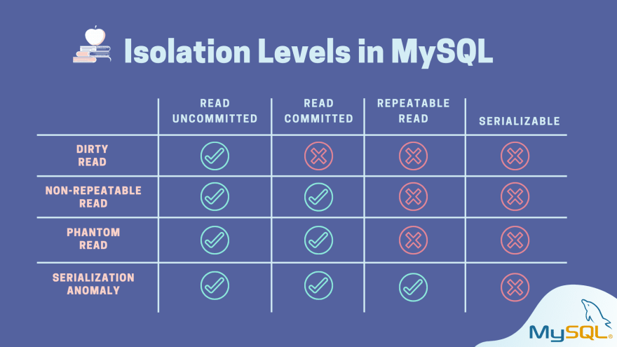
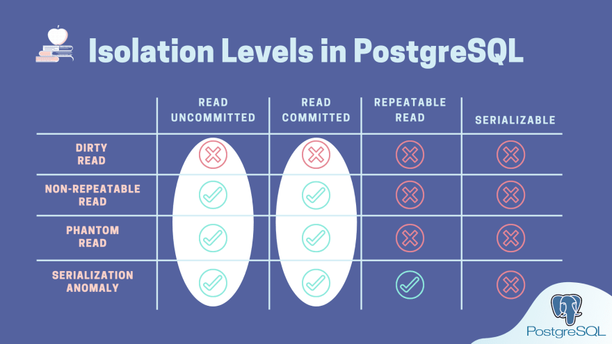

# Understand isolation levels & read phenomena in MySQL & PostgreSQL via examples

https://dev.to/techschoolguru/understand-isolation-levels-read-phenomena-in-mysql-postgres-c2e

隔离级别（Isolation）是数据库事务ACID属性中的I。

最高级别的隔离级别可以保证所有并发事务不会相互影响。

当数据库在低级别事务隔离级别下运行，会出现以下读现象：

- 脏读：事务读取其他并发事务写入当尚未提交的数据（其他事务回滚恢复数据为初始值）
- 不可重复读：事务两次读取同一条记录看到不同的值（该行被第一次读取后提交的其他事务修改）
- 幻读：重新执行相同查询返回一组不同的行（其他事务插入或删除恰好满足当前事务搜索条件的现有行）
- 串行化异常：以任何顺序运行一组并发事务，结果可能不一致。

为了应对上述读现象，ANSI定义了4个标准隔离级别：

- 读未提交：事务可以看到其他未提交事务写入的数据（允许脏读发生）
- 读已提交：事务只能看到其他已提交事务写入的数据（不允许允许脏读发生）
- 可重复读：确保相同select查询始终返回相同结果（不允许不可重复读、幻读）
- 可串行化：并发事务保证能够产生相同的结果（不允许串行化异常）

隔离级别与读现象的关系：





---

mysql:

- 获取 MySQL 中的当前隔离级别

```bash
mysql> select @@transaction_isolation;
+-------------------------+
| @@transaction_isolation |
+-------------------------+
| REPEATABLE-READ         |
+-------------------------+
1 row in set (0.00 sec)
```

- 更改 MySQL 中的隔离级别

```bash
mysql> set session transaction isolation level read uncommitted;
Query OK, 0 rows affected (0.00 sec)
```

注意：此更改只会影响当前会话的所有未来事务，但不会影响在 MySQL 控制台的另一个会话上运行的事务。

---

postgresql：

- 获取 Postgres 中的当前隔离级别

```bash
root=# show transaction isolation level;
 transaction_isolation 
-----------------------
 read committed
(1 row)
```

- 更改 Postgres 中的隔离级别

```bash
root=# begin;
BEGIN
root=*# set transaction isolation level read uncommitted;
SET
```

---

如何处理序列化异常：

- pgsql：使用**依赖检测机制**来检测潜在的读现象并通过抛出错误来阻止。
- mysql：使用**锁机制**。

---

总结：

- 在使用高隔离级别时，您应该牢记的最重要的事情是可能会出现一些错误、超时甚至死锁。因此，我们应该谨慎地为我们的事务实施**重试机制**。
- 每个数据库引擎可能会以不同方式实现隔离级别。
- MySQL：[MySQL 的隔离级别文档 ](https://dev.mysql.com/doc/refman/8.0/en/innodb-transaction-isolation-levels.html)
- Postgres：[Postgres 的隔离级别文档](https://www.postgresql.org/docs/current/transaction-iso.html)